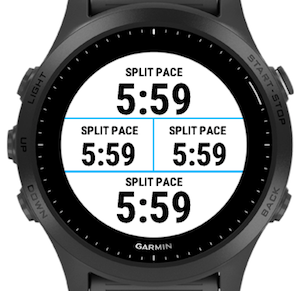

# About

Last Split - a Garmin [Connect IQ](https://developer.garmin.com/connect-iq/overview/) data field.

# Goal

Last Split displays the pace of the last km or mile (depending on your watch setting) at any time during an activity. It is useful to pace yourself evenly on a flat course. I use to together with the built-in current and average pace.

You can think of it as if you had Auto Laps enabled but instead of only showing you the pace (or time) after each lap you can look at it at any time during an anctivity. 

# Implementation

This app implements a [SimpleDataField](https://developer.garmin.com/connect-iq/api-docs/Toybox/WatchUi/SimpleDataField.html). The layout and font size of the data field is handled automatically by Garmin.

The screenshots below use the Last Split app in the "4 Field B" layout on a Garmin Forerunner 945:

# Installation

This app is not in the Garmin [Connect IQ store](https://apps.garmin.com/).

You can use [App Side Loading](https://developer.garmin.com/connect-iq/programmers-guide/getting-started) to install the app onto the device. Copy the compiled binary to the USB mounted Garmin watch into the directory `GARMIN/Apps`. On macos you can use [Android File Transfer](https://www.android.com/filetransfer/) as macos lacks good MTP (Media Transfer Protocol) support.

Latest pre-built [binary](./build/LastSplit.prg).
